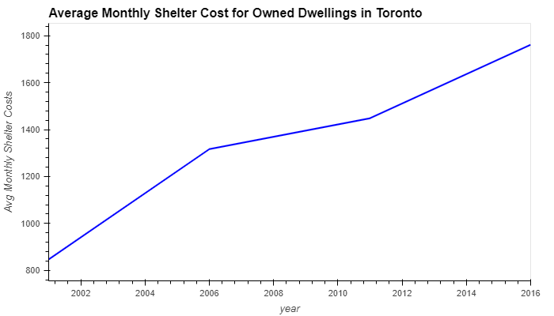
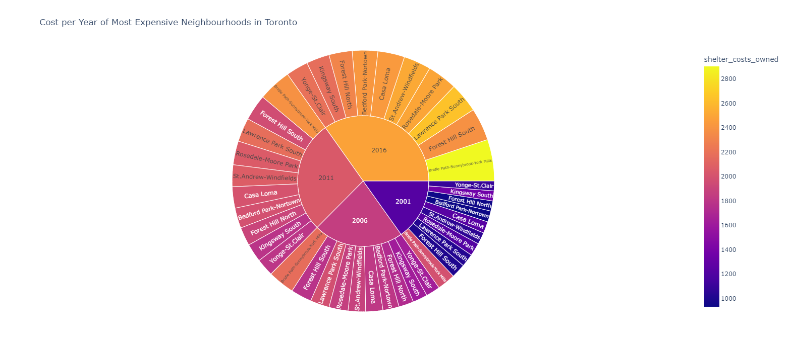

# Small Visualization Project with Pythons PyViz
Fintech course PyViz homework!

    <b>Toronto Dwellings Analysis & Dashboard By: Ebad Salehi</b>

    
  

## Table of Contents 

- [Introduction](#introduction)  
- [Project Description](#project-description)
- [Analysis](#Analysis)
- [Dashboard](#Dashboard)
- [Technologies Used](#Technologies-Used)

 

### Introduction 

---

This Project presents a Fundamental ANALYSIS and a DASHBOARD for the Toronto dwellings market to allow potential real estate investors to choose rental investment properties. It will provide "Interactive Visualizations" as well as "Static Charts" generated from statistics of <u>Differetnt Dwellings types</u> such as:
* single detached house
* apartment five storeys plus
* movable dwelling
* semi detached house
* row house
* duplex
* apartment five storeys less
* other house

in the years of 2001,2006,2011, and 2016.

---
### Analysis
By importing data from a CSV file and creating a DataFrame to display following charts for different neighbourhoods:

    
<b><i>By Neighbourhoods:</i></b>

    
    
<b><i> Price per Dwellings Type in specific year:</i></b>

    
    
<b><i>Average Monthly Shelter Costs of Owned/Rented Per Year:</i></b>

    
    
    
<b><i> Average House Value by Neighbourhood:</i></b>

    
    
<b><i> Mapbox Visualization:</i></b>

    
    
<b><i> Interactive Sunburst chart:</i></b>

      
        

---

### Dashboard
Provides a catalogue of all the charts generated via analysis in a compact and easy-to-use interactive Dashboard with multiple tabs:

    
    

 

---

### Technologies Used
   - Pandas
   - HvPlot
   - Plotly
   - matplotlib
   - Map Box API
   - pathlib
   - dotenv
   - Jupyetr notebook
     
 

    <b><a href="#header">↥ back to top</a></b>

 
